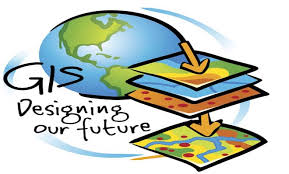
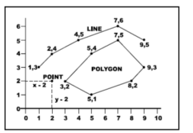
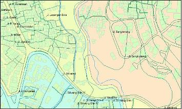
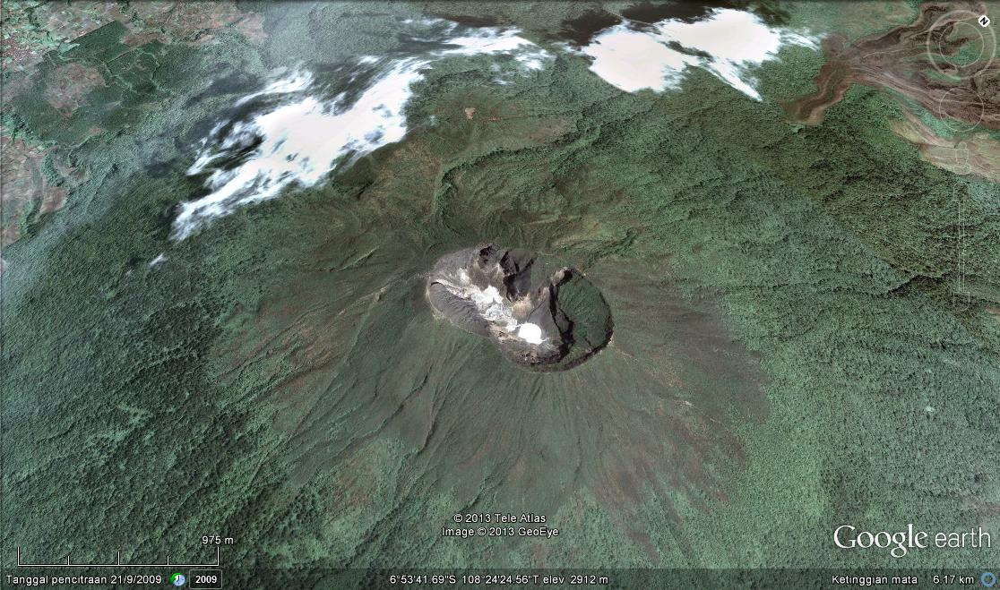
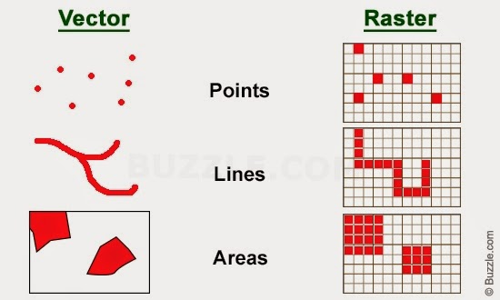

<h2 align="center">BAB I   PENDAHULUAN</h2>
<strong>Data Geospasial</strong>

 

 
Data geospasia ladalah data yang mengidentifikasi lokasi geografis dan/atau karakteristik objek alam dan/atau buatan manusia yang berada di bawah, pada, atau di atas permukaan bumi.
 
Dalam system informasi geografis, memiliki 2 jenis model data :
 
1.	Vector adalah data titk koordinat atau data berupa kumpulan titik. Memiliki format *.shp . Data vector ini diluncurkan ESRI. Bumi kita sendiri dipresentasikan dari berupa titik, garis dan polygon.
 

 

 
Data vector sendiri terdiri dari physical dan cultural. Physical maksudnya ada secara nyata, yang tidak berubah. Contohnya pulau, sungai, danau. Sedangkan cultural maksudnya vector yang dipengaruhi oleh peradaban, contohnya bangunan atau batas wilayah/kota.
 
2.	Raster adalah data berupa gambar yang dihasilkan dari pengindraan jauh. Contohnya pewarnaan pada peta.
 

 
 

 
Jika ingin lebih jelas, kita dapat membuka naturalearth.com dan dapat melakukan praktek dengan menggunakan aplikasi QGis. 