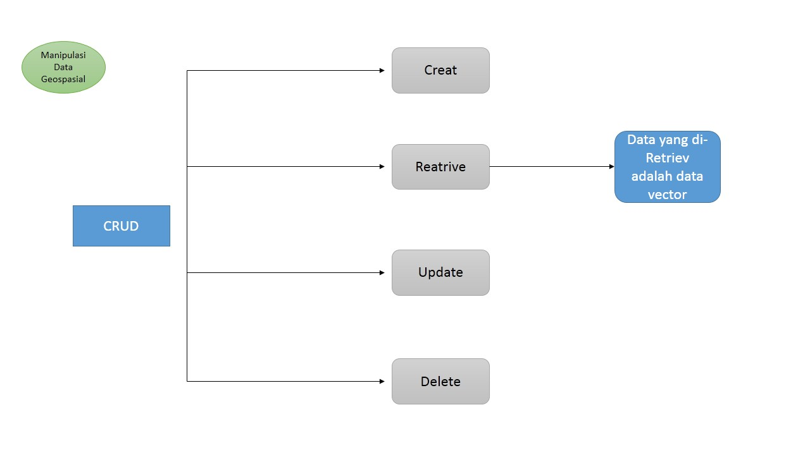

 
Retrieve data geospasial adalah meretrieve data vector
 
Data shape file => .shp
 
Operasi retrieve data menggunakan library phyton yang bernama py.shp
 
 
Shape file yang merupakan standar file
 
Vektor geospasila adalah data yang dikeluarkan secara resmi oleh ESRI
 

 
Data Geometri adalah Data koordinat yang membentuk bangun datar/ruang diantaranya
 
1.	Point/titik, yang memiliki nomor standar [1]
 
2.	Line/polyline/garis, yang memiliki nomor standar [3] 
 
3.	Polygon, yang memiliki nomor standar [5]
 
Inilah yang dimaksud data shapefile oleh ESRI yang memiliki nomor standard 
 
 
Operasi Pengambilan Data
 
Library pyshp class shapefile
 
 
Cara membaca
 
1.	Buka/Baca 
 
2.  SF = Shapefile.reader (“btsnegara.shp”)

 
 
Method SHp
 
Shapes()
 
Shape(n) , n adalah nomor record (bbox, parts, points, shapefile)
 
-	Bbox -> bording box, merupakan batas view peta 
 

 
Koordinat A,B,C,D itu disebut bbox 
 
 
-	Part -> points ini bagian dari record lain/pecahan record
 
-	Points -> koordinat membentuk peta
 
-	Shap type -> jenis geometri dari points 
 
 
Method DBF
 
Fields -> nama field/colom
 
Record(n) -> n adalah nomor sequence record 
 
Records()
 
Membuat class pada retrieve
 

 
Menampilkan select negara 
 

 
