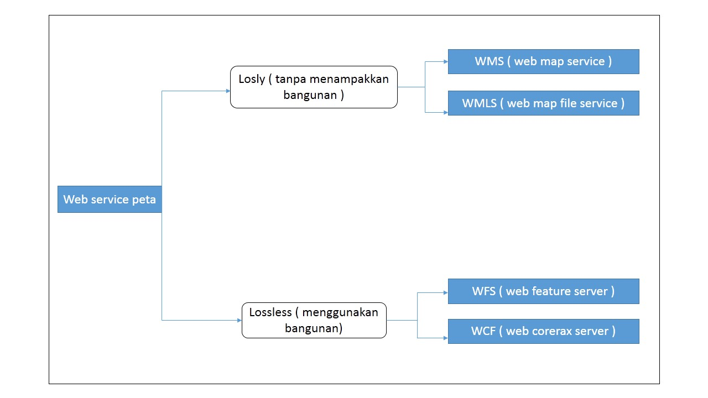

Map server adalah aplikasi penyedia layanan web (web service)

 
Map proxy adalah aplikasi penampung data sementara dari penyedia layanan web (web service peta) agar pengambilan data yang berulang-ulang lebih cepat (tanpa meminta kembali ke web service)
 
 
 
Menampilkan data peta 

 

 
Cara instalasi map server
 
Direkomendasikan menggunakan linux, bias juga menggunakan virtual box
 
Buka terminal (Ubuntu)
 
Sudo apt-get install cgi_mapserver
 
CenTos : google =>
 
         Map server awangga
 
  
 
Cara install mapproxy
 
1.      Sudo install phyton-pip phyton dev
 
2.      Sudo pip install mapproxy
 